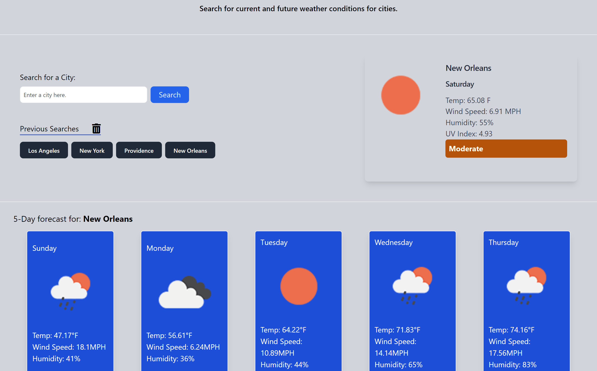

# weather-dashboard

## Description
Weather Dashboard allows users to search the weather in US cities. Users will enter a city to search and the application will display current and future weather conditions. The application uses localStorage to store persistent data so that when users click on a city in the search history, the weather data is presented again.

This application uses the Open Weather Map API for its weather data. Documentation can be found [here](https://openweathermap.org/api).

---
## Application information

Link to Application: [weather-dashboard](https://krissmith7.github.io/weather-dashboard/)

---
  ## Questions
  Contact the developer with any questions!
  [KrisSmith7](https://github.com/krissmith7)
 
